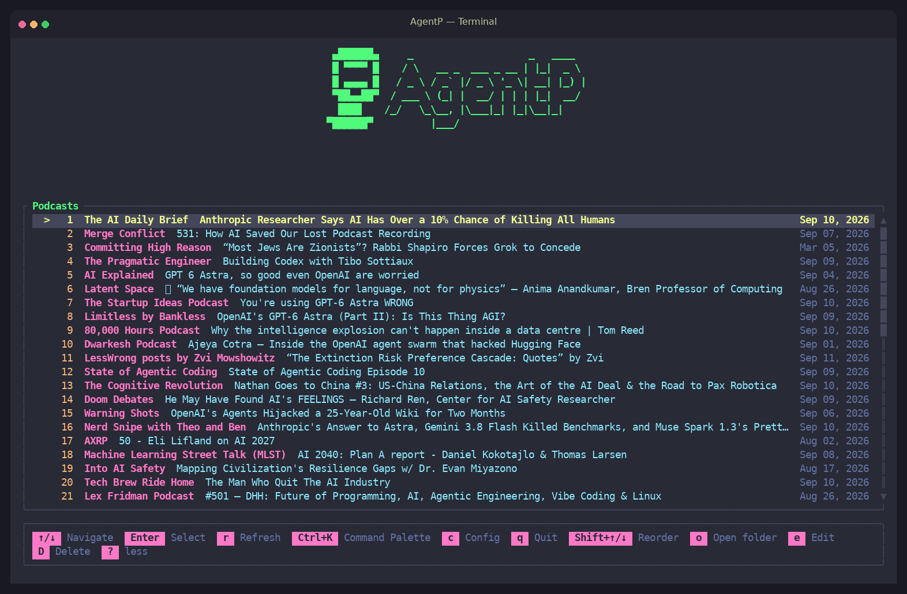
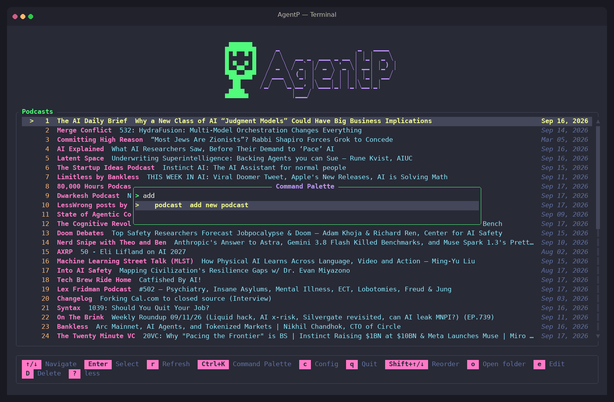
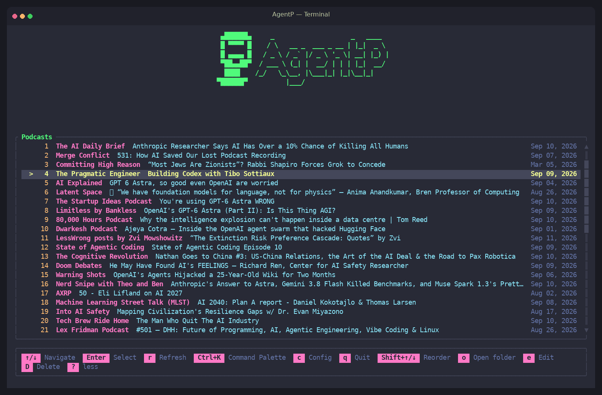
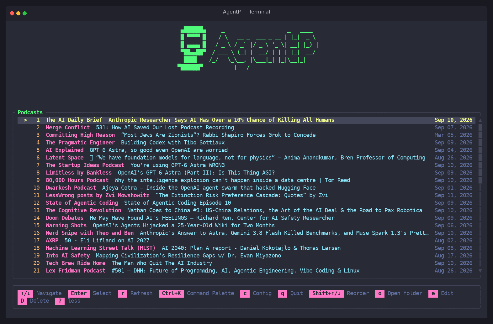
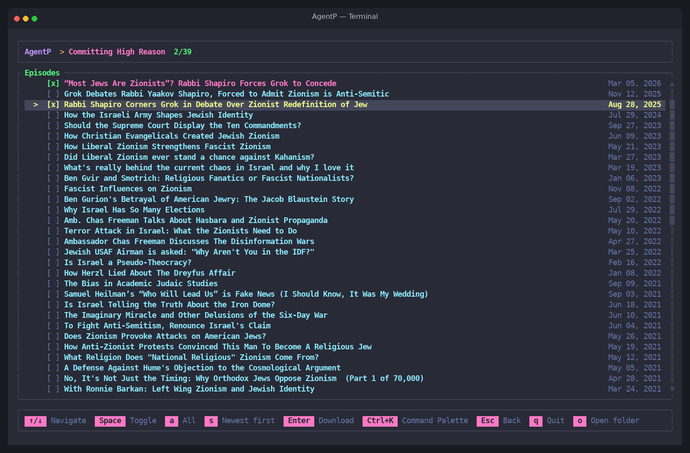
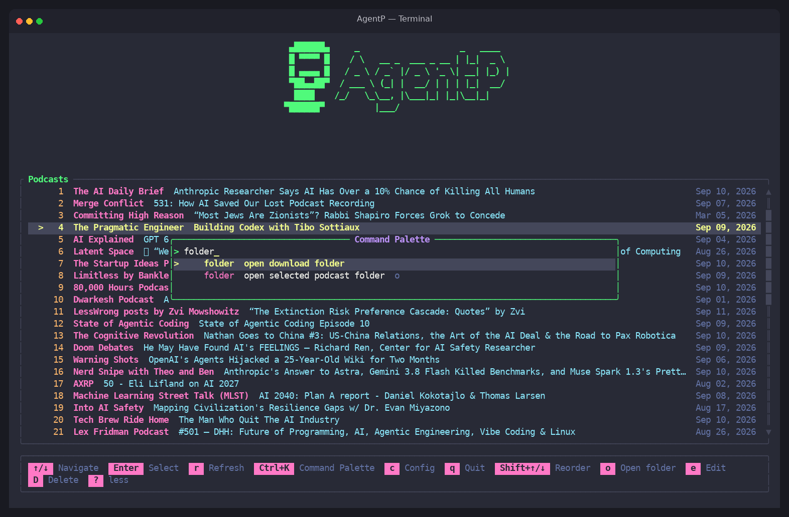
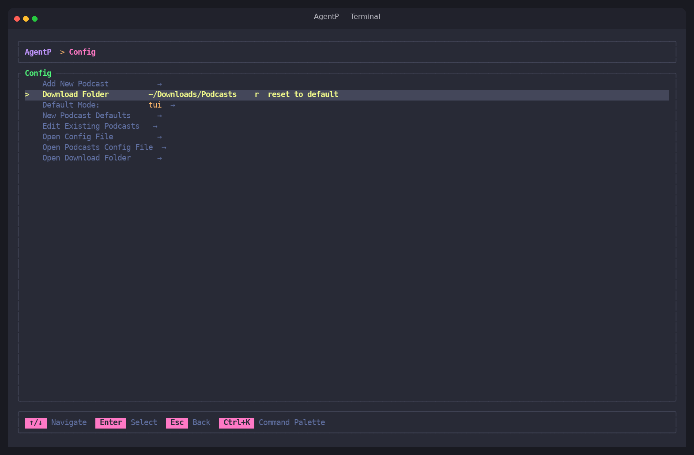

<h1 align="center">AgentP</h1>

<p align="center"><strong>A fast, polished podcast downloader for your terminal.</strong></p>

<p align="center">Browse feeds, select episodes, and write clean ID3 tags from an interactive TUI—or automate everything with the CLI.</p>

<p align="center">
  <a href="https://github.com/ByteMagicInc/AgentP/actions/workflows/ci.yml"></a>
  <a href="https://crates.io/crates/agent-p"></a>
  <a href="https://github.com/ByteMagicInc/AgentP/releases"></a>
  <a href="https://www.gnu.org/licenses/gpl-3.0"></a>
</p>

<p align="center">
  <a href="#installation">Installation</a> ·
  <a href="#quick-start">Quick start</a> ·
  <a href="#keyboard-reference">Keyboard reference</a> ·
  <a href="#cli-reference">CLI reference</a> ·
  <a href="#configuration">Configuration</a> ·
  <a href="#troubleshooting">Troubleshooting</a>
</p>

<p align="center">
  
</p>

## Why AgentP?

| | |
|---|---|
| **Interactive or automated**<br>Choose episodes in the TUI or script repeatable downloads with the CLI. | **Library-ready metadata**<br>Control album, artist, title, artwork, filenames, and numeric prefixes. |
| **Any RSS podcast**<br>Add a feed manually or let AgentP prepopulate its channel metadata. | **Flexible selection**<br>Download specific episodes, the latest or oldest N, or the complete feed. |
| **Fast command palette**<br>Press `Ctrl+K` to find actions without memorizing every shortcut. | **Runs everywhere**<br>One Rust binary for macOS, Linux, and Windows with a built-in Dracula theme. |

## Installation

| Method | Install |
|---|---|
| **Homebrew** · macOS and Linux | `brew install ByteMagicInc/tap/agent-p` |
| **Scoop** · Windows | `scoop bucket add bytemagicinc https://github.com/ByteMagicInc/scoop-bucket`<br>`scoop install agent-p` |
| **Cargo** · Rust 1.87+ | `cargo install agent-p` |
| **Pre-built binary** | Download an archive from [GitHub Releases](https://github.com/ByteMagicInc/AgentP/releases) and place `agentp` on your `PATH`. |

> [!TIP]
> Alpine and other minimal Linux distributions can use the fully static `x86_64-unknown-linux-musl` build.

## Quick start

### Interactive TUI

```sh
agentp
```

The first launch creates your configuration, seeds a set of demo podcasts, and points downloads at `~/Downloads/Podcasts` so you can explore immediately:

1. Choose a podcast and press `Enter`.
2. Mark episodes with `Space` or select everything with `a`.
3. Press `Enter` to download.

Press `c` to add your own feeds, change the download folder, and set the defaults for new podcasts.

### Scriptable CLI

```sh
agentp podcast add --feed-url <RSS_URL> --from-feed
agentp podcast list
agentp download --podcast <NAME_OR_INDEX> --latest 5
```

Podcast selectors accept either a 1-based index or a case-insensitive name. A subcommand always runs headlessly, and the mode flags do not change that. With no subcommand, `agentp` opens the TUI unless `config.json` sets `"default_mode": "cli"`, and `--tui` or `--cli` (aliases `--user-mode` and `--agent-mode`) override that default for a single run, where `--cli` prints this help. `--help` works on every command and `agentp --version` prints the version.

## See AgentP in action

### Add a podcast from its RSS feed

<p align="center">
  
</p>

### Find actions and update configuration

<p align="center">
  
</p>

### Screenshots

| Podcast library | Episode selection |
|---|---|
| [](docs/assets/podcast-list.png) | [](docs/assets/episode-selection.png) |

| Command palette | Configuration |
|---|---|
| [](docs/assets/command-palette.png) | [](docs/assets/configuration.png) |

## Keyboard reference

Every screen lists its own keys in the bar at the bottom. Press `?` to expand it, or `Ctrl+K` to search every action by name.

### Global

| Key | Action |
|---|---|
| `Ctrl+K` | Toggle the command palette |
| `Ctrl+C` | Quit from anywhere, including during a download (asks first if the podcast editor has unsaved changes) |
| `q` | Quit when not typing in a text field; ignored while a download is running |
| `Ctrl+V` | Paste into the active text field or the palette filter |
| `?` or `.` | Expand or collapse the key-hint bar |

### Any list

Available on the podcast list, episode select, podcast picker, config menu, and the podcast editor.

| Key | Action |
|---|---|
| `Home` / `g` | Jump to the first row |
| `End` / `G` | Jump to the last row |
| `PageUp` / `PageDown` | Move ten rows |

### Podcast list

| Key | Action |
|---|---|
| `j` / `↓`, `k` / `↑` | Move selection |
| `Enter` | Open episode list |
| `Shift+↑` / `Shift+↓` | Reorder podcasts |
| `r` | Refresh feeds |
| `e` | Edit selected podcast |
| `o` | Open selected podcast folder |
| `c` | Config menu |
| `D` | Delete selected podcast; confirm with `y` or `D`, cancel with `Esc` |

Deleting is the one confirmation that does not take `Enter`. `Enter` opens a podcast on this screen, and removing one cannot be undone.

### Episode select

| Key | Action |
|---|---|
| `j` / `↓`, `k` / `↑` | Move selection |
| `Space` | Toggle episode |
| `a` | Toggle all |
| `s` | Sort (newest/oldest) |
| `o` | Open podcast folder |
| `Enter` | Download selected |
| `Esc` | Back |

<details>
<summary>Keys for the command palette, download screen, config menu, wizard, and editor</summary>

### Command palette

| Key | Action |
|---|---|
| Type | Filter actions |
| `↑` / `↓`, `Shift+Tab` / `Tab` | Move selection |
| `Enter` | Run the selected action |
| `Esc` | Close |

### Downloading

| Key | Action |
|---|---|
| `Esc` | Back to the podcast list once the run has finished |
| `q` | Ignored while the transfer runs, so a stray keypress cannot leave a partial file |

### Config menu

The menu has eight rows: **Add New Podcast**, **Download Folder**, **Default Mode**, **New Podcast Defaults**, **Edit Existing Podcasts**, **Open Config File**, **Open Podcasts Config File**, and **Open Download Folder**.

| Key | Action |
|---|---|
| `j` / `↓`, `k` / `↑` | Move selection |
| `Enter` | Activate the row (edit the folder path, toggle `tui`/`cli`, open an editor, or open a file or folder) |
| `r` on **Download Folder** | Reset the download folder to the built-in default |
| `Enter` / `Esc` while editing the path | Confirm or cancel the new folder path |
| `y` / `Enter`, `Esc` | Answer a confirmation dialog |
| `Esc` | Back to the podcast list |

### Add podcast wizard

| Key | Action |
|---|---|
| `Enter` on Feed URL | Open the mode selector |
| `1` / `m` | Manual — fill every field yourself |
| `2` / `p` / `Enter` | Prepopulate from feed — fetches the channel title, album, and artist |
| `Enter` | Next step (the last step saves the podcast) |
| `Tab` / `↓` / `j` on a yes/no or numeric step | Next step |
| `↑` / `k` / `Backspace` on a yes/no or numeric step | Previous step |
| `Backspace` on an empty text step | Previous step |
| `Space` | Toggle a yes/no step |
| `←` / `-`, `→` / `+` | Adjust the leading-zeros count |
| `Ctrl+V` | Paste into a text step |
| `Esc` | Cancel the wizard, or cancel an in-flight feed fetch |

### Edit podcast

| Key | Action |
|---|---|
| `j` / `↓`, `k` / `↑` | Move between fields |
| `Enter` | Edit a text field or toggle a yes/no field |
| `Enter` / `Esc` while editing text | Commit or cancel the edit |
| `Space` | Toggle a yes/no field |
| `←` / `-`, `→` / `+` | Adjust the leading-zeros count |
| `r` | Restore the current field to its built-in default |
| `R` | Reset every yes/no and numeric field to built-in defaults (template editor only) |
| `s` | Save |
| `Esc` | Back; asks `s` save / `d` discard / `Esc` cancel if there are unsaved changes |
| `Ctrl+V` | Paste into the text field being edited |

</details>

## CLI reference

Commands that select a podcast accept either its 1-based index or a case-insensitive name. Run `agentp <command> --help` for the full flag list.

### Podcasts

```sh
agentp podcast list
agentp podcast list --no-fetch
agentp podcast show --podcast "Darknet Diaries"
agentp podcast episodes --podcast 1 --limit 20
agentp podcast add --name "My Show" --feed-url https://example.com/feed.xml
agentp podcast add --feed-url https://example.com/feed.xml --from-feed
agentp podcast add --feed-url https://example.com/feed.xml --from-feed --artist "Jane Doe" --overwrite-file-name true
agentp podcast edit --podcast 2 --name "New Name" --feed-url https://example.com/new.xml
agentp podcast edit --podcast 2 --remove-images true
agentp podcast delete --podcast "Old Show"
```

New podcasts start from the `default_podcast` template in `config.json`. `--from-feed` fills in the name, album, and artist from the channel metadata; `--name` still wins if you pass both. Every per-podcast option in the [table below](#per-podcast-options-podcastsjson) is also a flag on `podcast add` and `podcast edit`, and yes/no flags take an explicit `true` or `false`.

### Downloads

```sh
agentp download --podcast 1 --latest 5
agentp download --podcast 1 --oldest 5
agentp download --podcast 1 --episodes 3,7,12
agentp download --podcast 1 --all
```

`--episodes`, `--latest`, `--oldest`, and `--all` are mutually exclusive and exactly one is required. Episode index `1` is always the newest episode; `agentp podcast episodes` prints the indices.

### Configuration and folders

```sh
agentp config show
agentp config set --download-dir ~/Podcasts
agentp config set --default-mode cli
agentp config path

agentp open downloads
agentp open downloads --create
agentp open podcast --podcast 1 --create
```

`open` refuses to open a folder that does not exist yet; `--create` makes it first.

## Configuration

Config lives under `$HOME/.config/AgentP/` (or `%USERPROFILE%\.config\AgentP\` on Windows). `agentp config path` prints the directory.

- `config.json` — download folder, the `default_podcast` template, and `default_mode` (`tui` or `cli`)
- `podcasts.json` — your podcast list, as `{ "podcasts": [ ... ] }`

### Per-podcast options (`podcasts.json`)

Each entry in `podcasts.json` has the same shape as `default_podcast` plus its identity fields. The **CLI flag** column applies to `podcast add` and `podcast edit`.

| Field | CLI flag | Purpose |
|---|---|---|
| `name` | `--name` | Display name in lists |
| `feed_url` | `--feed-url` | RSS feed URL |
| `album_name` | `--album-name` | Subfolder name and album tag; falls back to `name` when empty |
| `artist` | `--artist` | Artist and album-artist tag |
| `user_agent` | `--user-agent` | Custom `User-Agent` for this podcast's audio downloads; empty uses AgentP's default |
| `overwrite_tags` | `--overwrite-tags` | Master switch for writing ID3 text tags |
| `remove_existing_tags` | `--remove-existing-tags` | Drop the source file's ID3 tag and write a fresh minimal one (only when `overwrite_tags` is on) |
| `remove_images` | `--remove-images` | Strip embedded cover art; works even when `overwrite_tags` is off |
| `overwrite_album_name` | `--overwrite-album-name` | Write the album tag |
| `overwrite_artist` | `--overwrite-artist` | Write the artist and album-artist tags |
| `overwrite_title` | `--overwrite-title` | Write the title tag |
| `overwrite_file_name` | `--overwrite-file-name` | Rename the file to the episode title |
| `append_number_to_title` | `--append-number-to-title` | Prefix the title tag with the episode number |
| `leading_zeros_amount` | `--leading-zeros-amount` | Zero-padding for that number; `3` pads to four digits (`0001`), `0` disables |

> [!NOTE]
> Older configs that use `override_*`, `leading_zeros_to_title`, `remove_image`, or `create_new_tags` still load. AgentP rewrites them with the current key names the next time it saves.

### New-podcast defaults

The `default_podcast` block in `config.json` is copied into every podcast you create, whether through the TUI wizard or `agentp podcast add`. Edit it from **New Podcast Defaults** in the TUI config menu or directly in the file. Changing the template does not touch podcasts that already exist.

### Download layout

Downloads are organized by album name, which falls back to the podcast name when empty:

```text
<download_dir>/
└── <album_name>/
    ├── <episode>.mp3
    └── <episode>.mp3
```

Without `overwrite_file_name`, the filename is the last path segment of the episode's enclosure URL (hosts that wrap the real file URL inside a redirect link, such as Anchor, are unwrapped), falling back to the final response URL and then `default.mp3`. With it, the file is renamed to `<sanitized episode title>.mp3`. Downloading an episode again overwrites the existing file.

When `overwrite_tags` is on, AgentP writes the title, album, and artist plus album-artist frames that you have enabled and leaves every other frame alone. Turn on `remove_existing_tags` to discard the source file's tag first, which helps when a host embeds large metadata blocks that confuse players.

> [!NOTE]
> Episode indices are **1-based with 1 = newest**. This applies to `--episodes`, `--latest`, `--oldest`, and numeric title prefixes. With `leading_zeros_amount: 3`, episode 1 becomes `0001`, episode 10 becomes `0010`, and episode 100 becomes `0100`.

## Troubleshooting

- **`... (internet-filter/proxy) blocked URL ...`** — the host answered with an HTML or text page instead of audio. This usually means a proxy or content filter intercepted the request, or the host rejected AgentP's `User-Agent`. Check the filter, or set `user_agent` on that podcast (`agentp podcast edit --podcast N --user-agent "..."`).
- **A feed adds fine but every download fails** — some hosts (Buzzsprout's CDN, for example) refuse anonymous clients. AgentP sends `AgentP/<version>` by default; a browser-style `user_agent` on the podcast usually resolves it.
- **`Episode index N is out of range`** — indices count from the newest episode. Run `agentp podcast episodes --podcast N` to see the current numbering.
- **Start over** — delete `config.json` and `podcasts.json` from the directory printed by `agentp config path`. The next launch recreates both, including the demo podcasts.

## Building from source

Requires Rust 1.87+ (edition 2024). The binary lands at `target/release/agentp`.

```sh
git clone https://github.com/ByteMagicInc/AgentP.git
cd AgentP
cargo build --release
```

Before opening a pull request, run what CI runs:

```sh
cargo fmt --all -- --check && cargo clippy --all-targets -- -D warnings && cargo test --all
```

## Contributing

Issues and PRs welcome at <https://github.com/ByteMagicInc/AgentP>. See [AGENTS.md](AGENTS.md) for architecture details. Start commit messages with `Fix`, `Add`, `Refactor`, or `Update` so the changelog groups them correctly. Maintainers: [GO_LIVE.md](GO_LIVE.md) covers tagging a release, which builds binaries for six targets and publishes to crates.io, Homebrew, and Scoop.

## License

[GPL-3.0-only](LICENSE) © 2026 ByteMagic Inc.
